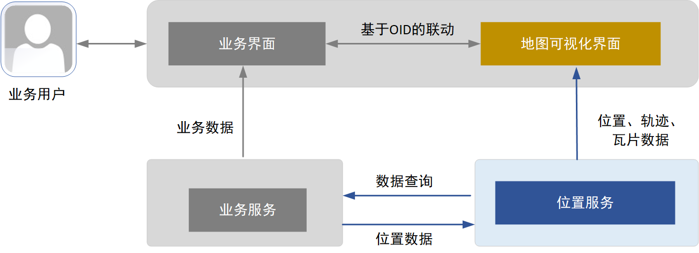
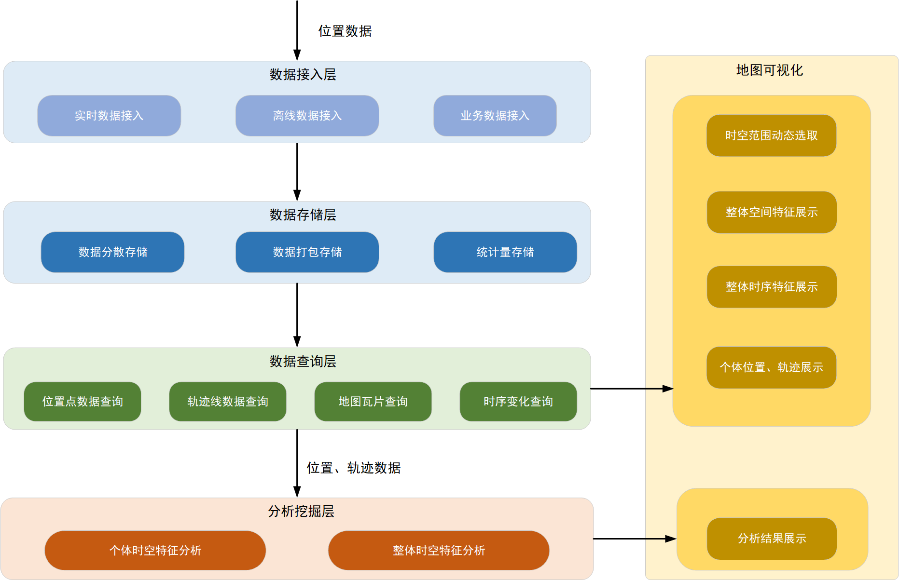
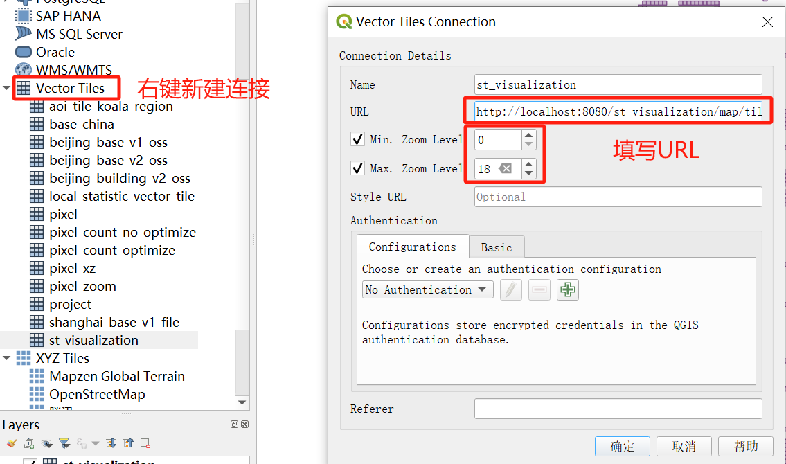
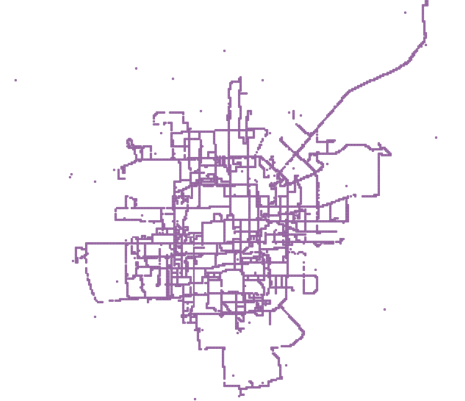
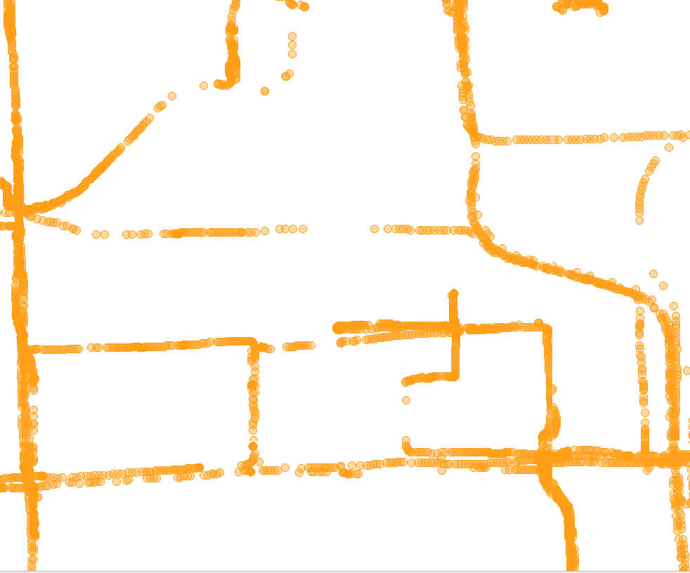

# 1. 业务架构图

# 2. 产品架构图

# 3. Demo运行

## 3.1 运行初始化程序

1. 在application.yml文件中修改个人Postgresql数据库的连接参数
2. 运行TileServiceTest的testInitData测试方法，完成数据初始化
3. 控制台会输出QGIS中用于请求地图瓦片的URL

## 3.2 QGIS地图可视化

1. 本地启动STVisualizationApp服务
2. 在QGIS的VectorTiles中新建连接，使用3.1中得到的URL，看到可视化效果

